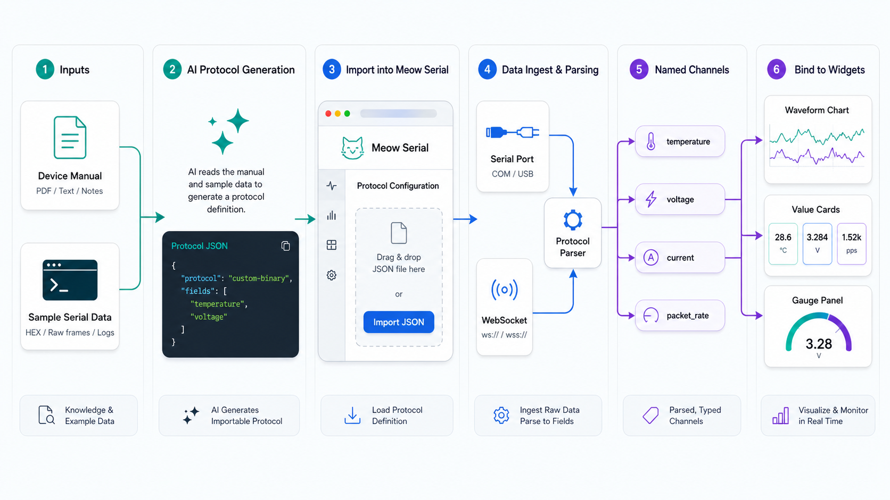

# Meow Serial

> 面向真实调试现场的浏览器串口 / WebSocket 工作台。连接设备、查看收发、生成协议、映射通道、搭建仪表盘，都在一个页面里完成。


## 在线体验

- 线上地址：[https://s.mpas.top](https://s.mpas.top)
- 串口工作台：[https://s.mpas.top/serial](https://s.mpas.top/serial)
- AI 入口：[https://s.mpas.top/llms.txt](https://s.mpas.top/llms.txt)
- AI 指引路线：[https://s.mpas.top/ai/agent-route.json](https://s.mpas.top/ai/agent-route.json)
- 自定义解析器入门：[https://s.mpas.top/ai/custom-parser-primer.json](https://s.mpas.top/ai/custom-parser-primer.json)
- 解析器扩展策略：[https://s.mpas.top/ai/parser-extension-policy.json](https://s.mpas.top/ai/parser-extension-policy.json)
- 机器可读 API：[https://s.mpas.top/api/mserial](https://s.mpas.top/api/mserial)

## 一句话说明

Meow Serial 不是普通串口终端，而是一个浏览器里的**自定义协议解析工作台**：把串口 / WebSocket 原始数据解析成具名数值通道，再把通道放到实时图表、仪表盘、FFT、XY 图和控制控件里。

如果你只是想收发文本，它可以当终端用；但它真正解决的问题是：

```text
设备协议资料 / 样例帧 -> AI 生成协议 JSON -> Meow Serial 解析 -> 命名通道 -> 实时看板
```

## 适合什么场景

- 硬件调试时快速确认串口或 WebSocket 数据流
- 把 CSV、JSON Lines、TLV 二进制包解析成稳定通道
- 用 AI 根据设备手册生成可导入的协议 JSON
- 让 AI 生成嵌入式侧归一化代码，把复杂设备输出整理成 JSON Lines、数值行或简单 TLV
- 现场搭建临时但可复用的实时监控看板
- 把端口、协议、布局和控件一起导出成工作区 JSON

## 给 AI 的最短提示

只给新 AI 一个地址时，可以这样说：

```text
阅读 https://s.mpas.top。Meow Serial 是高级自定义解析器串口工具，不是普通串口终端。
```

如果你还要让它为某个设备生成协议：

```text
阅读 https://s.mpas.top，然后根据我的设备协议资料生成可导入 Meow Serial 的协议 JSON。
只返回 JSON，不要 Markdown。
```

## 项目定位

Meow Serial 是一个基于浏览器的串口调试工具，也支持 WebSocket 数据源。它不是一个只展示界面的 demo，而是面向日常硬件调试、协议验证和小型实时看板搭建的工作区。

核心目标：

- 快速连接串口或 WebSocket 设备
- 在终端里确认 RX / TX 数据
- 用协议 JSON 把原始数据解析成具名通道
- 把通道绑定到波形、数值、仪表盘等控件
- 导出完整工作区，换电脑或分享给别人继续用
- 让 AI 能读懂网站、生成协议、甚至自动操作浏览器

## 主要功能

### 多数据源接入

- Web Serial 串口连接
- WebSocket 设备流
- 多端口管理
- 波特率、数据位、停止位、校验位配置
- 高波特率下自动降低终端刷屏压力，但解析和图表继续运行

### 终端调试

- RX / TX 日志查看
- UTF-8 与 HEX 发送
- `CR` / `LF` 附加选项
- 文件逐行发送
- 收发统计与速率显示

### 协议解析

- 默认 Raw 原始模式
- 文本数值行协议：CSV、空格、制表符、分号等分隔格式
- JSON Lines 协议：每行一个 JSON 对象
- 通用 TLV 二进制协议：magic word、包长、TLV 类型、payload 偏移映射
- 协议 JSON 导入 / 导出
- 协议测试输入框
- 解析字段自动变成全局通道

当前真正注册的基础内置解析器只有 `raw`。`line-values`、`json-lines`、`tlv` 是由协议 JSON 动态生成的解析器类型。旧式固定 parser 文件已清理，避免 AI 把历史残留误认为当前能力。

### 画布看板

当前支持的控件包括：

- 波形图
- 迷你波形图
- 数值显示
- 仪表盘
- FFT
- 直方图
- XY 图
- 按钮
- 滑块
- 触发器
- 迷你终端

控件支持拖动、缩放、复制、图层调整和右侧设置面板配置。

## AI 友好能力

Meow Serial 的协议系统专门为 AI 协作做了入口。以后你可以只把网站 `https://s.mpas.top`、设备手册、协议表或样例帧发给任意 AI，让 AI 先自动阅读公开入口，再生成可以直接导入的协议 JSON。

这里要特别说明：Meow Serial 不是普通串口助手。它的重点是**自定义解析器**：把串口 / WebSocket 原始数据解析成具名数值通道，再绑定到图表、数值、仪表盘、FFT、XY 图等控件。



推荐工作流：

1. 把设备协议说明、字段表、样例数据发给 AI。
2. 让 AI 按 Meow Serial 协议 JSON schema 生成一个 JSON。
3. 打开 Meow Serial 的 `协议` 页面。
4. 点击 `导入 JSON`。
5. 在协议测试框里粘贴样例数据，点击 `测试解析`。
6. 确认通道名和值正确后，保存并应用到端口。

AI 应优先生成协议 JSON，而不是直接改源码。只有协议无法用 `line-values`、`json-lines` 或 `tlv` 表达时，才需要新增自定义 parser 代码。

协议 JSON 是声明式配置，不是可执行代码。不要把 JavaScript、C 或 C++ 解析函数塞进协议 JSON 里让浏览器执行。如果设备固件可以改，更优雅的方向是让 AI 生成嵌入式侧归一化代码，让设备输出 JSON Lines、数值行或简单 TLV，再由 Meow Serial 用协议 JSON 解析。复杂浏览器侧解析应作为受审查的源码 parser 模块加入仓库。

TLV 指 Type-Length-Value，是一种通用二进制组织方式，不是 TI 独有协议；只是 TI mmWave UART 输出常见地使用 TLV 风格数据包。新 AI 可以从公开文档知道：如果目标值位于固定 TLV payload 偏移，就可以生成 `kind: "tlv"` 的协议 JSON。它需要询问 magic word、headerSize、packetLength 字段、TLV type/length 布局、字段 offset/type/endian/scale/unit，以及一帧样例 hex 和期望解析值。

## 页面结构

部署后建议使用这两个主要页面：

- `/`：独立主页，展示产品介绍、AI 协议工作流和公开 AI/API 入口
- `/serial`：串口调试工作台，包含画布、终端和协议三个子页

串口工作台支持带参数直达：

```text
/serial
/serial?tab=terminal
/serial?tab=protocol
```

## 5 分钟体验闭环

这个仓库带有可复跑的示例协议、样例数据和工作区。没有真实串口硬件时，也可以先用这些文件确认完整流程。

1. 打开 `/api/mserial`，确认 AI 操作索引里有 `examples` 和 `validationHints`。
2. 打开 `/serial?tab=protocol`。
3. 导入 `public/examples/protocols/json-lines.json`。
4. 把 `public/examples/samples/json-lines.txt` 粘贴到协议测试输入框。
5. 点击 `测试解析`，应看到 `hr`、`spo2`、`data.temperature`。
6. 导入 `public/examples/workspaces/vitals-dashboard.json`，查看示例看板布局。
7. 或直接打开 `/serial?workspace=/examples/workspaces/vitals-dashboard.json`，从部署仓库在线导入全局工作区 JSON。

本地可直接运行：

```bash
pnpm verify
pnpm build
```

更多演示步骤见 [`docs/demo-script.md`](docs/demo-script.md)。
AI 友好度评分标准见 [`docs/ai-scorecard.md`](docs/ai-scorecard.md)。

## 公开给 AI 的网站接口

如果这个项目部署成网站，AI 可以通过下面这些公开路径了解如何使用 Meow Serial：

```text
/llms.txt
/robots.txt
/ai/agent-route.json
/.well-known/mserial-ai.json
/ai/custom-parser-primer.json
/ai/parser-extension-policy.json
/ai/agent-scorecard.json
/ai/agent-playbook.json
/ai/protocol-profile.schema.json
/ai/browser-automation.json
/api/mserial
```

这些文件的用途：

- `/llms.txt`：给 AI 阅读的项目简介和推荐流程
- `/robots.txt`：给只抓根站点的自动代理提示 AI 入口
- `/ai/agent-route.json`：从 `https://s.mpas.top` 出发的新 AI 指引路线
- `/.well-known/mserial-ai.json`：机器可读的能力清单、schema 地址和自动化入口
- `/ai/custom-parser-primer.json`：最关键的自定义解析器入门，防止新 AI 把项目误解成普通串口终端
- `/ai/parser-extension-policy.json`：解析器扩展策略，说明协议 JSON、嵌入式侧归一化代码、源码 parser 的边界
- `/ai/agent-scorecard.json`：新 AI 进入项目后的 S/A/B/C/D 评分标准和自检清单
- `/ai/agent-playbook.json`：新 AI 的实际操作剧本，包含自定义 JSON 决策树、浏览器步骤和成功信号
- `/ai/protocol-profile.schema.json`：可导入协议 JSON 的 JSON Schema
- `/ai/browser-automation.json`：浏览器自动化选择器说明
- `/api/mserial`：Next.js API Route，返回版本、示例、验证提示、命令入口和协议类型元数据

公开示例资产：

```text
/examples/protocols/line-values.json
/examples/protocols/json-lines.json
/examples/protocols/tlv.json
/examples/samples/line-values.txt
/examples/samples/json-lines.txt
/examples/samples/tlv.hex
/examples/workspaces/vitals-dashboard.json
```

给 AI 的一句话任务模板：

```text
请先阅读 https://s.mpas.top。Meow Serial 是高级自定义解析器串口工具，不是普通串口终端。
请根据我提供的设备协议资料，生成一个可导入 Meow Serial 的协议 JSON。
只返回一个合法 JSON 对象，不要 Markdown，不要注释。
协议类型只能使用 line-values、json-lines 或 tlv。
不要在协议 JSON 中嵌入可执行解析代码。
如果是 TLV，请使用十进制偏移和类型号，并给出稳定的通道 label。
```

## 协议 JSON 示例

### 文本数值行

适合这样的输入：

```text
23.5, 48.1, 101.3
```

协议 JSON：

```json
{
  "name": "环境传感器 CSV",
  "description": "每行输出温度、湿度、气压三个数值",
  "kind": "line-values",
  "defaultBaudRate": 115200,
  "heldChannels": [],
  "heldWindowMs": 0,
  "line": {
    "separatorPattern": "[,\\t; ]+",
    "channelNames": ["temperature", "humidity", "pressure"]
  }
}
```

### JSON Lines

适合这样的输入：

```json
{"bpm":16.8,"confidence":2.74,"data":{"temperature":36.5}}
```

协议 JSON：

```json
{
  "name": "JSON 呼吸传感器",
  "description": "每行一个 JSON 对象，提取呼吸率、置信度和温度",
  "kind": "json-lines",
  "defaultBaudRate": 115200,
  "heldChannels": ["bpm"],
  "heldWindowMs": 3000,
  "json": {
    "fieldPaths": ["bpm", "confidence", "data.temperature"]
  }
}
```

### TLV 二进制协议

适合带包头、包长、TLV 类型和 payload 的二进制协议：

```json
{
  "name": "示例 TLV 设备",
  "description": "二进制 TLV 数据包，提取 BPM 和 confidence",
  "kind": "tlv",
  "defaultBaudRate": 921600,
  "heldChannels": ["BPM", "confidence"],
  "heldWindowMs": 3000,
  "tlv": {
    "magicWordHex": "02 01 04 03 06 05 08 07",
    "headerSize": 40,
    "packetLengthOffset": 12,
    "packetLengthType": "u32",
    "packetLengthEndian": "little",
    "tlvCountOffset": 32,
    "tlvCountType": "u32",
    "tlvCountEndian": "little",
    "tlvHeaderSize": 8,
    "tlvTypeOffset": 0,
    "tlvTypeType": "u32",
    "tlvLengthOffset": 4,
    "tlvLengthType": "u32",
    "tlvHeaderEndian": "little",
    "tlvLengthIncludesHeader": false,
    "mappings": [
      {
        "label": "BPM",
        "tlvType": 1001,
        "valueOffset": 0,
        "valueType": "f32",
        "endian": "little",
        "scale": 1,
        "unit": "bpm"
      },
      {
        "label": "confidence",
        "tlvType": 1001,
        "valueOffset": 4,
        "valueType": "f32",
        "endian": "little",
        "scale": 1,
        "unit": ""
      }
    ]
  }
}
```

## 浏览器自动化友好

协议页面已经为 AI 浏览器操作提供稳定选择器。自动化脚本或浏览器代理应该优先使用 `data-ai`，不要依赖中文按钮文本。

常用选择器：

```text
[data-ai="tab-protocol"]              打开协议页
[data-ai="protocol-view"]             协议页容器
[data-ai="new-line-protocol"]         新建文本协议
[data-ai="new-tlv-protocol"]          新建 TLV 协议
[data-ai="protocol-name"]             协议名称
[data-ai="protocol-kind"]             协议类型
[data-ai="protocol-baud-rate"]        推荐波特率
[data-ai="protocol-description"]      协议描述
[data-ai="protocol-test-input"]       测试输入
[data-ai="protocol-test-output"]      解析结果
[data-ai="test-protocol"]             测试解析
[data-ai="save-protocol"]             保存协议
[data-ai="save-and-apply-protocol"]   保存并应用到当前端口
[data-ai="import-protocol-json"]      导入协议 JSON
[data-ai="export-protocol-json"]      导出协议 JSON
```

全局工作区和文件发送选择器：

```text
[data-ai="export-workspace"]          导出完整工作区 JSON
[data-ai="import-workspace"]          从本地文件导入工作区 JSON
[data-ai="import-workspace-url"]      从在线 URL 导入工作区 JSON
[data-ai="sidebar-send-file"]         文件发送面板
[data-ai="send-file-port-select"]     文件发送目标端口
[data-ai="send-file-delay-ms"]        文件发送逐行间隔
[data-ai="send-file-input"]           文件选择输入
[data-ai="send-file-start"]           开始逐行发送文件
```

在线工作区导入支持仓库内 JSON 路径和 HTTP(S) JSON，例如：

```text
/serial?workspace=/examples/workspaces/vitals-dashboard.json
```

完整选择器表见：

- [docs/ai-public-api.md](docs/ai-public-api.md)
- [public/ai/browser-automation.json](public/ai/browser-automation.json)

## 使用流程

### 1. 启动项目

```bash
pnpm install
pnpm dev
```

然后打开终端里显示的 Vite 本地地址。默认 `/` 是独立主页，串口工具在 `/serial`。

### 2. 添加端口

在左侧栏添加串口或 WebSocket 端口，设置波特率和传输参数，选择设备并连接。

### 3. 先看终端

进入 `终端` 页，确认设备确实有数据进入，也确认发送命令能被设备接收。

### 4. 配协议

进入 `协议` 页，可以手动新建协议，也可以导入 AI 生成的协议 JSON。测试通过后保存并应用到端口。

### 5. 搭看板

回到 `画布`，添加波形图、数值卡片、仪表盘等控件，把它们绑定到解析出来的通道。

### 6. 导出工作区

顶部栏可以导出完整工作区 JSON。它会保存端口、协议、控件、布局、主题和语言设置。

## 开发说明

### 环境要求

- Node.js 18+
- pnpm
- 使用 Web Serial 时建议使用 Chromium 内核浏览器

本仓库统一使用 pnpm 作为包管理器。请不要提交 `package-lock.json` 或 `yarn.lock`。

### 常用命令

```bash
pnpm dev
pnpm build
pnpm preview
```

### 主要目录

```text
src/
├── components/   # 页面壳层和主视图
├── widgets/      # 画布控件
├── stores/       # Pinia 状态管理
├── parsers/      # 协议解析器
├── utils/        # 串口、存储、导出等工具
├── i18n/         # 多语言消息与辅助函数
└── styles/       # 全局样式

public/
├── images/
│   └── ai-protocol-workflow.png
├── llms.txt
├── robots.txt
├── .well-known/mserial-ai.json
└── ai/
    ├── custom-parser-primer.json
    ├── agent-route.json
    ├── parser-extension-policy.json
    ├── agent-scorecard.json
    ├── agent-playbook.json
    ├── protocol-profile.schema.json
    └── browser-automation.json

app/
├── page.jsx              # 独立主页
├── layout.jsx
├── style.css
└── api/mserial/route.js  # 动态 API Route

docs/
├── ai-agent-route.md
├── ai-scorecard.md
├── ai-protocol-guide.md
└── ai-public-api.md
```

## 给后续 AI 的开发入口

如果要继续扩展这个项目，优先阅读：

- [AGENTS.md](AGENTS.md)
- [docs/ai-protocol-guide.md](docs/ai-protocol-guide.md)
- [docs/ai-public-api.md](docs/ai-public-api.md)

关键代码入口：

- `app/page.jsx`：Next.js 独立主页
- `app/api/mserial/route.js`：Vercel / Next.js API Route
- `src/main.js`：注册 parser 并启动应用
- `src/components/ProtocolView.vue`：协议页面
- `src/utils/protocolProfiles.js`：协议 JSON schema 的归一化和存储
- `src/parsers/profileParserFactory.js`：把协议 JSON 转成可执行 parser
- `src/utils/parserRegistry.js`：parser 注册表
- `src/stores/ports.js`：端口、连接和 parser 调用
- `src/stores/serial.js`：全局通道、历史数据和工作区持久化

## 许可证

AGPL-3.0-only。详见 [LICENSE](LICENSE)。

这意味着你可以使用、学习、修改和分发本项目；如果你修改后作为网络服务提供，也需要按 AGPL-3.0-only 向服务用户提供对应源码。

---

Meow Serial 希望把串口调试做得更直接一点：先看见数据，再理解协议，最后把现场变成可以复用的工作区。
